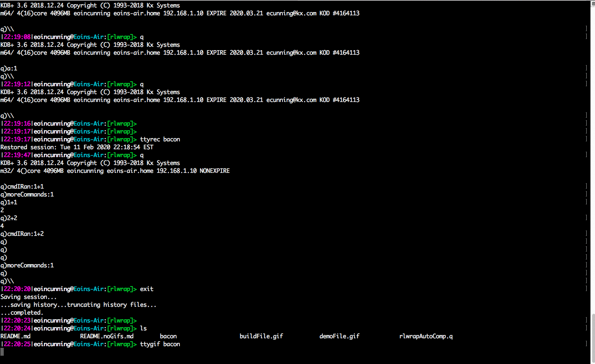
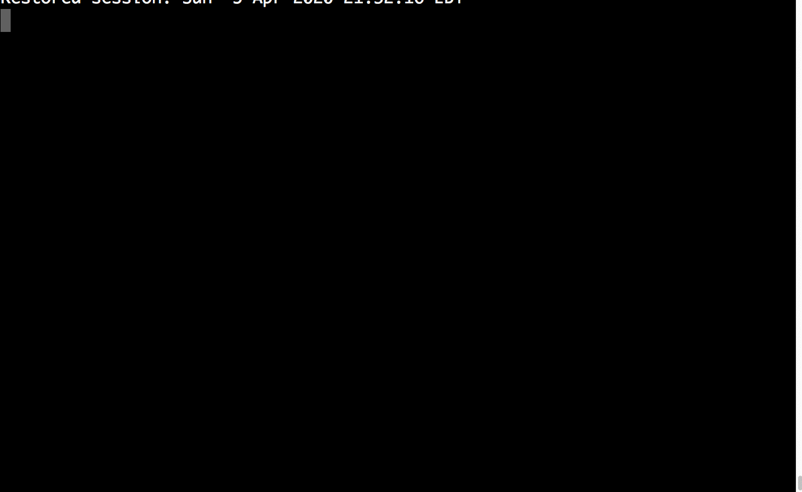
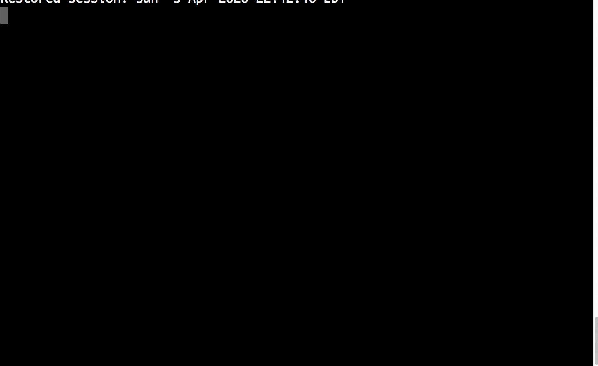

# Unwrapping rlwrap
Sometimes developers have a choice, spend five minutes completing a menial task or spend three hours learning how to most optimally complete it....

A lot longer than three hours later and below is all I have to show for it, but hopefully it will help you get the most out of rlwrap with q.

Out of the box a kdb+ console does not support using arrow keys to edit the line of code you are writing or go back through the history of commands you have entered. Rlwrap is a small utility which enables these features.

If you aren’t already using rlwrap already here's how to install it.

mac: https://code.kx.com/q/learn/install/macos/#install-rlwrap 

linux: https://code.kx.com/q/learn/install/linux/#install-rlwrap 

Note rlwrap is only available for linux and mac os and not on windows.

Usually developers install rlwrap. Update their q alias and be happy that they no longer have to type entire lines of code left to right in a language read right to left without being able to use the arrow keys.

But there's actually some useful features of rlwrap that most developers don't seem to be aware of and that's what this post hopes to share.

## CTRL-r

### Problem
You have a cmd that you executed previously that you want to re-execute or edit slightly and execute without having to retype the whole thing. Or endlessly hitting the up arrow until you find it.

### Solution
Similarly to how you can search through your history in a bash shell. You can search through all your q history by first hitting CTRL-r then typing what you're searching for.

The latest match will then appear, You can use the up arrow to look at older lines that also match. Once you've found the one you were looking for hit the right or left arrow to edit before executing. Or enter to execute same line again.



## CTRL-l

### Problem
You're showing somebody something in q and you have a mess of code on your screen, or maybe while sharing your screen you can’t really see the bottom of the screen properly or just want to start from blank to make things clear.

### Solution
CTRL-l works as a short cut for 'clear' command. No one may ever need to know about that embarassing 'type error...



## rlwrap -f 

### Problem
Maybe you've just started learning kdb+ and you can’t remember this big list of all the q functions. You have https://code.kx.com/q/ref/ bookmarked but are just fed up having to keep checking

... or maybe you're an experienced developer that’s just started a new role and really can’t be bothered trying to remember all the new function names in the framework you are now going to be using

... or like me you just really struggle spelling recipricol reciprical ... "(%:)" . Seriously 10 letters for a q function?

### Solution

The -f, --file option:
```
  -f, --file file
         Split file into words and add them to the completion word list. 
         This option can be given more than once, and adds to the default completion list in 
         $RLWRAP_HOME or /usr/share/rlwrap/completions.

```

This will allow us to start typing a function and then hit ‘tab’ to auto-complete/show us all the options we have. Much like when you press tab in unix when writing out file paths.

Now we just need a way to populate this file. The tools in order to do this have been included in a script to accompany this blog.

Start your q session load in all the functions you want to be included in your auto complete list.

Then load in function above and run

```
.rac.buildRlwrapCompFile ` sv (hsym `$system"echo $HOME"),`qRlwapAutoComplete.txt
```



Now start a new q session with (edit or add alias to your .bashrc)


```
rlwrap -f ~/qRlwapAutoComplete.txt q
```

Now when you hit 'tab' twice you will see all the options in ~/qRlwapAutoComplete.txt 


You'll never have to spell reciprocal again.

